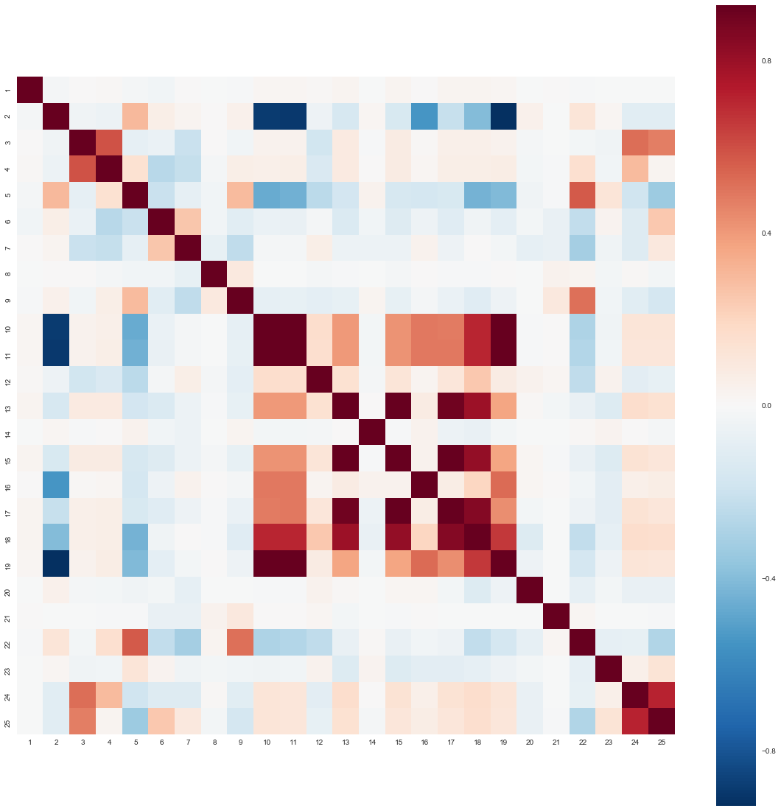
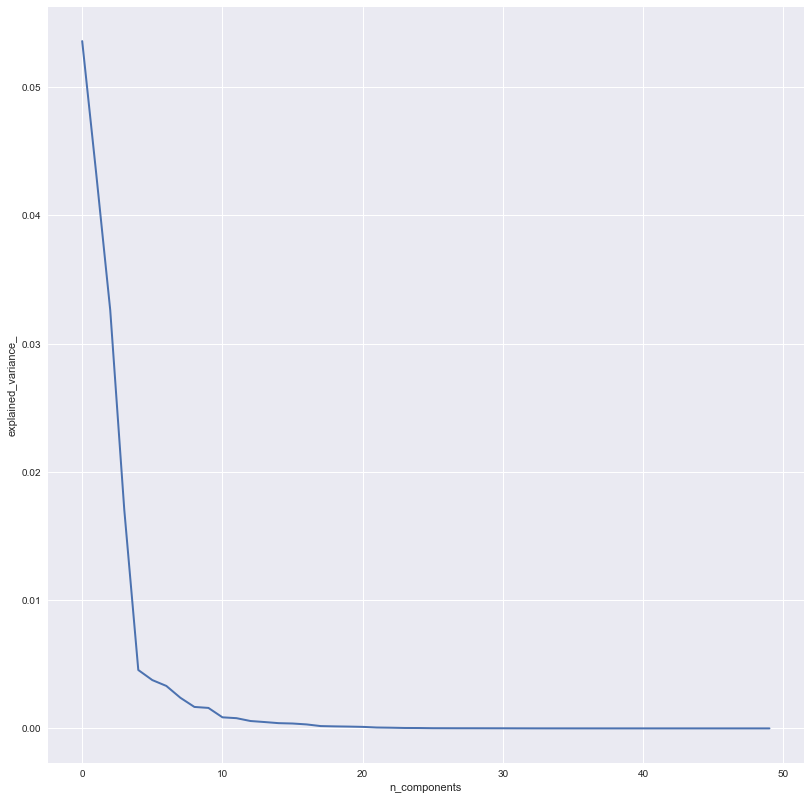

# Accounting Research
# Factorm Clustering Analysis of Financial Ratios

### Notebook Configurations


```python
import numpy as np
import pandas as pd
import seaborn as sns
import matplotlib.pyplot as plt
from collections import Counter
from sklearn.decomposition import PCA,FactorAnalysis
from sklearn.cluster import KMeans
from sklearn import preprocessing, linear_model, decomposition
from sklearn.pipeline import Pipeline
from sklearn.model_selection import cross_val_score
```

### Data Preparation


```python
data = pd.read_csv("data/US_GAAP_2011.csv")
factors = pd.read_csv("data/US_factors.csv")
data.columns = list(range(1,51))
corr = data.corr()
dec_corr = corr.sort_index(ascending=False)
data.head()
```


<div>
<table border="1" class="dataframe">
  <thead>
    <tr style="text-align: right;">
      <th></th>
      <th>1</th>
      <th>2</th>
      <th>3</th>
      <th>4</th>
      <th>5</th>
      <th>6</th>
      <th>7</th>
      <th>8</th>
      <th>9</th>
      <th>10</th>
      <th>...</th>
      <th>41</th>
      <th>42</th>
      <th>43</th>
      <th>44</th>
      <th>45</th>
      <th>46</th>
      <th>47</th>
      <th>48</th>
      <th>49</th>
      <th>50</th>
    </tr>
  </thead>
  <tbody>
    <tr>
      <th>0</th>
      <td>42.129630</td>
      <td>12.786144</td>
      <td>285.578828</td>
      <td>7.104444</td>
      <td>1.694915</td>
      <td>31.096376</td>
      <td>0.690371</td>
      <td>180.876494</td>
      <td>3.065703</td>
      <td>6.317104</td>
      <td>...</td>
      <td>56.277533</td>
      <td>83.527454</td>
      <td>4.418236</td>
      <td>0.613356</td>
      <td>2.567817</td>
      <td>163.037461</td>
      <td>32.963063</td>
      <td>47.659531</td>
      <td>19.164191</td>
      <td>2.511409</td>
    </tr>
    <tr>
      <th>1</th>
      <td>24.587598</td>
      <td>1.178338</td>
      <td>568.911048</td>
      <td>77.117896</td>
      <td>8.667923</td>
      <td>5.794678</td>
      <td>0.569748</td>
      <td>154.674448</td>
      <td>13.407062</td>
      <td>16.147590</td>
      <td>...</td>
      <td>124.490521</td>
      <td>242.278902</td>
      <td>5.072821</td>
      <td>1.869247</td>
      <td>1.076372</td>
      <td>53.497464</td>
      <td>23.229518</td>
      <td>73.672075</td>
      <td>69.513237</td>
      <td>11.780029</td>
    </tr>
    <tr>
      <th>2</th>
      <td>23.392283</td>
      <td>0.000000</td>
      <td>2769.314642</td>
      <td>307.476635</td>
      <td>11.163264</td>
      <td>14.465474</td>
      <td>0.309314</td>
      <td>27.811550</td>
      <td>3.104677</td>
      <td>-15.336764</td>
      <td>...</td>
      <td>-117.850638</td>
      <td>-94.089609</td>
      <td>10.003040</td>
      <td>15.281675</td>
      <td>1.050158</td>
      <td>6.543785</td>
      <td>22.089012</td>
      <td>44.521249</td>
      <td>-69.431644</td>
      <td>-3.168224</td>
    </tr>
    <tr>
      <th>3</th>
      <td>18.273444</td>
      <td>4.924854</td>
      <td>508.487363</td>
      <td>17.917767</td>
      <td>2.600673</td>
      <td>10.711415</td>
      <td>0.649931</td>
      <td>84.000000</td>
      <td>2.184566</td>
      <td>9.080457</td>
      <td>...</td>
      <td>131.706183</td>
      <td>-2638.888889</td>
      <td>6.922685</td>
      <td>2.171528</td>
      <td>1.163006</td>
      <td>46.050520</td>
      <td>33.603438</td>
      <td>58.883910</td>
      <td>27.022403</td>
      <td>8.526992</td>
    </tr>
    <tr>
      <th>4</th>
      <td>39.768908</td>
      <td>0.000000</td>
      <td>2999.940770</td>
      <td>2.645607</td>
      <td>0.080056</td>
      <td>61.602539</td>
      <td>0.630420</td>
      <td>91.044776</td>
      <td>0.072887</td>
      <td>6.115353</td>
      <td>...</td>
      <td>3924.590164</td>
      <td>-1340.000000</td>
      <td>9.222299</td>
      <td>0.356556</td>
      <td>2.999199</td>
      <td>280.461243</td>
      <td>17.428397</td>
      <td>10.708899</td>
      <td>35.088441</td>
      <td>7.582222</td>
    </tr>
  </tbody>
</table>
<p>5 rows × 50 columns</p>
</div>


### Data Exploration - Visualization - Correlations


```python
plt.subplots(figsize=(20, 20))
sns.heatmap(corr[:25][corr.columns[:25]], vmax=.9, square=True)
plt.show()
```





```python
plt.subplots(figsize=(20, 20))
sns.heatmap(corr[25:][corr.columns[25:]], vmax=.9, square=True)
plt.show()
```


```python
plt.subplots(figsize=(20, 20))
ax = sns.heatmap(dec_corr[:26][dec_corr.columns[:25]], vmax=.9, square=True)
ax.invert_yaxis()
plt.show()
```


```python
plt.subplots(figsize=(20, 20))
ax = sns.heatmap(dec_corr[24:][dec_corr.columns[25:]], vmax=.9, square=True)
ax.invert_yaxis()
plt.show()
```

### Complete Correlation Matrix


```python
plt.subplots(figsize=(20, 20))
sns.heatmap(corr, vmax=.9, square=True)
plt.show()
```

# Features Reduction - Kmeans Clustering

### Transformations - Normalize, PCA Reduction


```python
df = preprocessing.normalize(data.as_matrix(), norm='l1')
reduced_2d = PCA(n_components=2).fit_transform(df)
```

### Unsupervised Dimensionality Reduction


```python
logistic = linear_model.LogisticRegression()
pca = decomposition.PCA()
pipe = Pipeline(steps=[('pca', pca), ('logistic', logistic)])
```


```python
pca.fit(df)
plt.figure(figsize=(15, 15))
plt.clf()
plt.axes([.2, .2, .7, .7])
plt.plot(pca.explained_variance_, linewidth=2)
plt.axis('tight')
plt.xlabel('n_components')
plt.ylabel('explained_variance_')
plt.show()
```





```python
def compute_scores(X,n_components):
    pca = PCA(svd_solver='full')
    fa = FactorAnalysis()

    pca_scores, fa_scores = {}, {}
    for n in n_components:
        pca.n_components = n
        fa.n_components = n
        pca_scores[n] = np.mean(cross_val_score(pca, X))
        fa_scores[n] = np.mean(cross_val_score(fa, X))

    return {"pca_scores": pca_scores, "fa_scores": fa_scores}
```


```python
n_components = np.arange(10, 15)  # options for n_components
scores = compute_scores(df,n_components)
scores = pd.DataFrame(scores)
scores
```


<div>
<table border="1" class="dataframe">
  <thead>
    <tr style="text-align: right;">
      <th></th>
      <th>fa_scores</th>
      <th>pca_scores</th>
    </tr>
  </thead>
  <tbody>
    <tr>
      <th>10</th>
      <td>182.612789</td>
      <td>126.891099</td>
    </tr>
    <tr>
      <th>11</th>
      <td>183.098101</td>
      <td>125.443178</td>
    </tr>
    <tr>
      <th>12</th>
      <td>186.432887</td>
      <td>124.676660</td>
    </tr>
    <tr>
      <th>13</th>
      <td>180.815650</td>
      <td>123.652364</td>
    </tr>
    <tr>
      <th>14</th>
      <td>183.647193</td>
      <td>123.423738</td>
    </tr>
  </tbody>
</table>
</div>


### Complete Correlation Matrix - Normalize Data


```python
plt.subplots(figsize=(20, 20))
sns.heatmap(pd.DataFrame(df).corr(), vmax=.9, square=True)
plt.show()
```


```python
# scree plot
```

### K-Means Model: 10  - PCA Components: 2


```python
kmeans_2d = KMeans(init='k-means++', n_clusters=10, n_init=10)
kmeans_2d.fit(reduced_2d)
```


```python
reduced_2d.shape
```


```python
kmeans_2d.labels_.shape
```

### Visualize PCA Reduced Data


```python
plt.subplots(figsize=(20, 20))
plt.plot(reduced_2d[:, 0], reduced_2d[:, 1], 'k.', markersize=6)
plt.show()
```

### K-means Clustering -  Visualization


```python
# Size of the mesh.
h = .001

# Plot the decision boundary.
x_min, x_max = - 1, 1
y_min, y_max = - 1, 1
xx, yy = np.meshgrid(np.arange(x_min, x_max, h), np.arange(y_min, y_max, h))
Z = kmeans_2d.predict(np.c_[xx.ravel(), yy.ravel()])

# Put the result into a color plot
Z = Z.reshape(xx.shape)

plt.subplots(figsize=(20, 20))
plt.clf()

plt.imshow(Z, interpolation='nearest',
           extent=(xx.min(), xx.max(), yy.min(), yy.max()),
           cmap=plt.cm.Paired,
           aspect='auto', origin='lower')

plt.plot(reduced_2d[:, 0], reduced_2d[:, 1], 'k.', markersize=7)

# Plot the centroids as a white X
centroids = kmeans_2d.cluster_centers_
plt.scatter(centroids[:, 0], centroids[:, 1],
            marker='x', s=169, linewidths=5,
            color='w', zorder=10)

plt.title('K-means clustering on PCA-reduced data and Centroids')
plt.xlim(x_min, x_max)
plt.ylim(y_min, y_max)
plt.show()
```


```python
Counter(kmeans_2d.labels_)
```

# K-means Clustering - PCA - Cluster 10

### Transformations - Normalize, PCA Reduction


```python
df.shape
```


```python
reduced_data = PCA(n_components=11).fit_transform(df)
reduced_data.shape
```


```python
reduced_data = PCA(n_components=11).fit_transform(df.T)
reduced_data.shape
#reduced_data = PCA(n_components=11).fit_transform(df.T)
```


```python
data_fa = FactorAnalysis(n_components=12).fit_transform(df.T)
data_fa = pd.DataFrame(data_fa)
data_fa.index = factors['label']
data_fa.head()
```


<div>
<table border="1" class="dataframe">
  <thead>
    <tr style="text-align: right;">
      <th></th>
      <th>0</th>
      <th>1</th>
      <th>2</th>
      <th>3</th>
      <th>4</th>
      <th>5</th>
      <th>6</th>
      <th>7</th>
      <th>8</th>
      <th>9</th>
      <th>10</th>
      <th>11</th>
    </tr>
    <tr>
      <th>label</th>
      <th></th>
      <th></th>
      <th></th>
      <th></th>
      <th></th>
      <th></th>
      <th></th>
      <th></th>
      <th></th>
      <th></th>
      <th></th>
      <th></th>
    </tr>
  </thead>
  <tbody>
    <tr>
      <th>a_1</th>
      <td>-0.143795</td>
      <td>-0.099797</td>
      <td>-0.135252</td>
      <td>0.366406</td>
      <td>-0.242712</td>
      <td>-0.277372</td>
      <td>6.970977</td>
      <td>0.261439</td>
      <td>0.053624</td>
      <td>-0.004625</td>
      <td>-0.000391</td>
      <td>-0.023752</td>
    </tr>
    <tr>
      <th>a_2</th>
      <td>-0.143378</td>
      <td>-0.281464</td>
      <td>-0.142794</td>
      <td>-0.386311</td>
      <td>-0.327465</td>
      <td>-0.323751</td>
      <td>-0.159217</td>
      <td>0.150312</td>
      <td>-0.436785</td>
      <td>0.123106</td>
      <td>0.287120</td>
      <td>-0.356258</td>
    </tr>
    <tr>
      <th>a_3</th>
      <td>-0.146273</td>
      <td>6.809076</td>
      <td>-1.117159</td>
      <td>-1.037797</td>
      <td>-0.229769</td>
      <td>-0.411944</td>
      <td>-0.039873</td>
      <td>-0.009395</td>
      <td>-0.070357</td>
      <td>0.059029</td>
      <td>-0.066813</td>
      <td>-0.174677</td>
    </tr>
    <tr>
      <th>a_4</th>
      <td>-0.143725</td>
      <td>-0.020199</td>
      <td>-0.174889</td>
      <td>-0.305684</td>
      <td>-0.334707</td>
      <td>-0.255149</td>
      <td>-0.173129</td>
      <td>0.168728</td>
      <td>0.562148</td>
      <td>-0.715145</td>
      <td>1.534362</td>
      <td>4.790746</td>
    </tr>
    <tr>
      <th>a_5</th>
      <td>-0.143406</td>
      <td>-0.269479</td>
      <td>-0.142701</td>
      <td>-0.369602</td>
      <td>-0.324011</td>
      <td>-0.307698</td>
      <td>-0.155482</td>
      <td>0.132649</td>
      <td>-0.322360</td>
      <td>0.043791</td>
      <td>0.431541</td>
      <td>0.031675</td>
    </tr>
  </tbody>
</table>
</div>


```python
reduced_data = PCA(n_components=11).fit_transform(df.T)
reduced_data = pd.DataFrame(reduced_data)
reduced_data.index = factors['label']
reduced_data.head()
```

### K-Means Model - Clusters 10


```python
kmeans = KMeans(init='k-means++', n_clusters=10,n_init=10)
clusters = kmeans.fit_predict(reduced_data)
Counter(clusters)
```


```python
kmeans = KMeans(init='k-means++', n_clusters=12,n_init=10)
clusters = kmeans.fit_predict(data_fa)
Counter(clusters)
```


    Counter({0: 31,
             1: 1,
             2: 1,
             3: 1,
             4: 1,
             5: 1,
             6: 9,
             7: 1,
             8: 1,
             9: 1,
             10: 1,
             11: 1})


### Labeling Factors


```python
factors["cluster"] = clusters.tolist()
factors[factors['cluster']==6]
```


<div>
<table border="1" class="dataframe">
  <thead>
    <tr style="text-align: right;">
      <th></th>
      <th>factor</th>
      <th>label</th>
      <th>cluster</th>
    </tr>
  </thead>
  <tbody>
    <tr>
      <th>3</th>
      <td>Depreciation and amortization to total operati...</td>
      <td>a_4</td>
      <td>6</td>
    </tr>
    <tr>
      <th>11</th>
      <td>Gross profit margin</td>
      <td>a_12</td>
      <td>6</td>
    </tr>
    <tr>
      <th>21</th>
      <td>PPE to sales</td>
      <td>a_22</td>
      <td>6</td>
    </tr>
    <tr>
      <th>26</th>
      <td>Days sales outstanding (DSO)</td>
      <td>a_27</td>
      <td>6</td>
    </tr>
    <tr>
      <th>27</th>
      <td>Days payables outstanding</td>
      <td>a_28</td>
      <td>6</td>
    </tr>
    <tr>
      <th>30</th>
      <td>Equity ratio</td>
      <td>a_31</td>
      <td>6</td>
    </tr>
    <tr>
      <th>31</th>
      <td>Total liabilities to total capital (leverage)</td>
      <td>a_32</td>
      <td>6</td>
    </tr>
    <tr>
      <th>33</th>
      <td>Leverage structure</td>
      <td>a_34</td>
      <td>6</td>
    </tr>
    <tr>
      <th>46</th>
      <td>Current liabilities to sales</td>
      <td>a_47</td>
      <td>6</td>
    </tr>
  </tbody>
</table>
</div>
